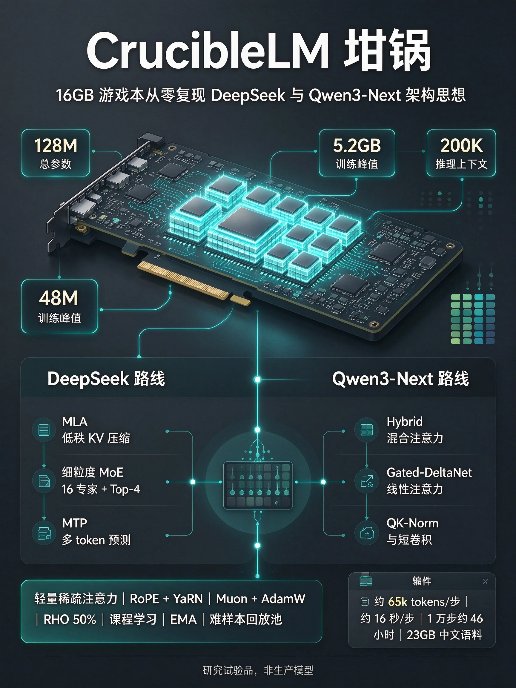

# CrucibleLM

<p align="center">
  
</p>

<p align="center">
  <a href="./LICENSE"></a>
  
  
  
  
</p>

> 融合最新 LLM 架构的实验性小模型：MLA + Hybrid 线性注意力 + 稀疏 + 细粒度 MoE，约 128M 参数，单卡 16G 可从零训练。

- **千分之一成本复现 SOTA 思想**——MLA、Gated-DeltaNet、细粒度 MoE、MTP、Muon，游戏本就能跑
- **200K 上下文推理就绪**——latent KV 缓存 + 线性递推状态 + 稀疏注意力
- **完整训练栈**——流式语料、SFT、跨词表蒸馏、评测、OpenAI 兼容服务

[English](./README.md) | [架构详解](./docs/ARCHITECTURE.md) | [训练血泪史](./docs/pitfalls/local-llm-training.md)

## 这是什么

CrucibleLM（坩埚）是一个**融合新架构的实验性小模型**：把 DeepSeek 系（MLA 低秩压缩、细粒度 MoE、MTP）与 Qwen-Next 系（Hybrid 全/线性注意力交替、门控线性层）熔于一炉，在约 128M 总参数 / 约 48M 激活下验证这些技术在小规模上的行为。单卡 16G 可从零训练，200K 上下文推理就绪。

这是研究试验品，不是生产模型。坑都记在 pitfalls 文档里了。

## 快速开始

```bash
pip install torch && pip install -e ".[hf]"  # datasets 用于 HF 流式语料
python scripts/train_local_llm.py --phase pretrain --preset tiny \
    --data local --local-path tests/fixtures/llm-corpus --max-steps 5
```

## 目录结构

```
CrucibleLM/
├── src/llm/local/      # 模型本体：MLA/线性/稀疏注意力、MoE、MTP、Muon、蒸馏、直觉头
├── scripts/            # train_local_llm.py（训练）/ migrate_model.py（架构迁移）/ extract_tool_choices.py
├── tests/              # 单测（需 torch，无 torch 自动跳过）
├── docs/               # ARCHITECTURE.md（架构与训练手册）/ pitfalls/（踩坑记录）
└── data/               # 语料与 checkpoint（gitignored，需自备）
```

## 复现训练全流程

环境：单卡 16G（如 RTX 3080 Laptop），Python 3.12，CUDA 版 torch。

```bash
# 0. 环境（独立 venv，别污染系统）
uv venv ~/.venvs/llm-train --python 3.12
uv pip install --python ~/.venvs/llm-train/bin/python torch datasets modelscope pyarrow transformers
# 说明：transformers 只给 KD 老师用（--kd-teacher）；不蒸馏可不装
export PATH="$HOME/.local/bin:$PATH"

# 1. 数据（魔搭 CN CDN，训练全程零网络；约 23GB）
~/.venvs/llm-train/bin/python -c "
from modelscope import snapshot_download
snapshot_download('epfml/FineWeb2-HQ', repo_type='dataset',
    allow_patterns=['cmn_Hani/000_0000[0-9].parquet',
                    'cmn_Hani/000_0001[0-9].parquet'], local_dir='data/hq-zh')
snapshot_download('openbmb/Ultra-FineWeb', repo_type='dataset',
    allow_patterns=['data/ultrafineweb_zh/ultrafineweb-zh-part-00[1-4]-of-256.parquet'],
    local_dir='data/ultra-zh')"
# SFT 数据（173MB，魔搭落盘 COIG + alpaca-gpt4-zh，见 docs/ARCHITECTURE.md 语料表）。
# 扩充（Belle 0.5M，51.9 万→去重后 42 万，HF 镜像直下，约 260MB）：
~/.venvs/llm-train/bin/python scripts/convert_sft.py \
  --dataset BelleGroup/train_0.5M_CN --out data/sft-belle --dedup-dir data/sft-zh
# 之后 --local-path 改成 "data/sft-zh:3,data/sft-belle:1" 混合训练
# 老师（0.5B，可选，SFT 蒸馏用）：
~/.venvs/llm-train/bin/python -c "
from modelscope import snapshot_download
snapshot_download('OpenBMB/MiniCPM4-0.5B', local_dir='data/teacher-0.5b')"

# 2. 预训练 base（约 65k tokens/步，16 秒/步，10k 步约 46 小时；前台直接跑）
~/.venvs/llm-train/bin/python scripts/train_local_llm.py \
  --phase pretrain --preset base \
  --seq-len 2048 --batch 4 --accum 8 \
  --max-steps 10000 --lr 3e-4 \
  --grad-ckpt --ckpt-dir data/llm-ckpt \
  --data local --local-path "data/hq-zh:3,data/ultra-zh:1" \
  --eval-every 200 --sample-every 200 \
  --extend-vocab --rho-keep 0.5 \
  --replay-ratio 0.15 --consolidate-steps 300 --resume

# 3. 监控（另开终端）
tail -f data/llm-ckpt/train.log   # loss 曲线（JSONL）
nvidia-smi -l 2                   # 显存（预训练约 5GB；开 KD 老师约 10GB）
# 健康标准：eval 稳步降、aux 恒 0.12、单进程；详见 docs/pitfalls/

# 4. SFT（base 收敛后，另起 ckpt 目录，base 原封不动留作回滚）
~/.venvs/llm-train/bin/python scripts/train_local_llm.py \
  --phase sft --preset base \
  --seq-len 2048 --batch 4 --accum 8 \
  --sft-init data/llm-ckpt/model.pt \
  --max-steps 2000 --lr 1e-4 --warmup 20 \
  --grad-ckpt --ckpt-dir data/llm-sft \
  --vocab data/llm-ckpt/vocab.json \
  --data local --local-path data/sft-zh \
  --extend-vocab --eval-every 100 --sample-every 100 \
  --kd-teacher data/teacher-0.5b --kd-alpha 0.5
```

关键默认值（不写即生效）：`--save-every 100` 存盘 + `--keep-last 20` 只留 20 个快照、
`--shuffle-buffer 512`、`--prefetch 4`、AdamW 优化器。续跑直接加 `--resume`
（权重/优化器/step/数据游标全续）。直连 HF 超时请用 `--hf-endpoint https://hf-mirror.com`。
长命令已收进 `configs/*.yaml`：`python scripts/run_train.py configs/sft-full.yaml` 前台跑
（`--dry-run` 只打印命令；`lr=1e-5` 这种 `key=value` 临时覆盖；配置自动存档到 `ckpt-dir/run.yaml`，复现认这个文件）。

## 训练阶段配置（`configs/`，启动器直跑）

| 阶段 | 配置 | 起点 → 产出 | 状态 |
|---|---|---|---|
| base 预训练 | `pretrain-base.yaml` | hq+ultra → `data/llm-ckpt` | 地基（vanilla 跑通） |
| SFT 全量单遍 | `sft-full.yaml` | base → `data/llm-sft` | **最新流程**（下节） |
| sft5 | `configs-local/sft5.yaml`（本机实验，不入库） | sft4-ckpt200 → `data/llm-sft5` | 进行中（引用历史产物，仅本机可跑） |

分阶段试错史（sft1→sft2→sft4）已验证结论、使命结束，配置从库里删除，
需要考古看 git 历史。结论只有一条：**RHO + 回放 + EMA 到位后，
分阶段≈手工课程，单遍全开等价且省时间**，所以最新流程只有两段。

## 从零复刻（最新流程，共两段）

```bash
# 0. 离线准备（一次跑完：Belle 转格式 + 检索索引；sft-zh 自备，见语料表）
python scripts/convert_sft.py --dataset BelleGroup/train_0.5M_CN \
  --out data/sft-belle --dedup-dir data/sft-zh
python scripts/build_retrieval.py --data data/sft-zh --sft \
  --out data/retro-sft.pkl --chunk 200 --overlap 20   # SFT 目录加 --sft（拼三元组文本）

# 1. base 预训练（vanilla 骨架，不开外挂；约 46 小时）
python scripts/run_train.py configs/pretrain-base.yaml

# 2. 记忆校准（B 方案：base 权重冻结跑 SFT 模板文本，约 10 分钟）
# keys 只需代表性聚类（value 恒零），base backbone 足够，不必等 SFT
python scripts/init_memory.py --src data/llm-ckpt/model.pt \
  --vocab data/llm-ckpt/vocab.json --data data/sft-zh --out data/llm-sft-mem-init
# 组合起点（记忆校准 + 全零 retro，恒等校验差 0.0 才继续）：
~/.venvs/llm-train/bin/python -c "
import torch
from src.llm.local.config import SmallLLMConfig
from src.llm.local.model import TinyLLM
cfg = SmallLLMConfig(); cfg.memory_every = 4
cfg.retro_enabled = True; cfg.retro_every = 4; cfg.retro_chunk_len = 64
m = TinyLLM(cfg)
missing, unexpected = m.load_state_dict(
    torch.load('data/llm-sft-mem-init/model.pt', map_location='cpu'), strict=False)
assert not unexpected and missing and all('retro' in k for k in missing)
torch.save(m.state_dict(), 'data/llm-sft-both-init-base/model.pt')
print('both-init ok')"

# 3. SFT 全量单遍（`configs/sft-full.yaml`，约 20 小时；冠军自动进 best/）
python scripts/run_train.py configs/sft-full.yaml
```

说明：预训练故意用 vanilla 骨架（稳定已验证；外挂零初始化恒等，SFT 阶段再加等价，
还省 10k 步的检索开销；B 校准本来就需要训好的 backbone）。
SFT 只跑一遍：RHO-teacher 只反向难 token、15% hq 回放防过拟合、
EMA 影子评测 + 冠军快照兜底——分阶段的手工课程已被这三个机制替代。
从 step 0 全开技术上可行（flag 都有），但没验证过，属实验性质。

## 进阶开关（默认全关，详见 docs/ARCHITECTURE.md）

- 长上下文：`longctx_config()` 200K 推理（YaRN×8 + 稀疏 MLA），训练走"短训 + 外推 + 分阶段微调"；
- 优化器：`--optimizer muon`（约 2x 效率，优化器显存减半）；
- 学习效率：`--rho-keep`（RHO 选择）、`--curriculum`（课程）、`--ema-*`（EMA 影子）、`--replay-*`（回放池）；
- 跨词表蒸馏：`--kd-teacher`（MiniCPM 0.5B，锚点 KL）；
- 架构迁移：`scripts/migrate_model.py`（加深/加宽/裁剪 + `--init-checkpoint` 续训）；
- 记忆层：`--enable-memory --memory-slots/--memory-topk/--memory-every`（Product-Key
  记忆层，value 零初始化，恒等起点，开关不破坏已有权重；开训前先用
  `scripts/init_memory.py` 跑 B 方案校准产出起始权重，再 `--sft-init` 载入）；
- 检索融合：`--enable-retro --retro-db <pickle>`（RETRO-lite，BM25 捞回片段拼成前缀
  mem 段；索引用 `scripts/build_retrieval.py` 构建）；V2 交错用
  `--retro-every N --retro-len L`（每 N 层融合 token 级 chunk，frozen 编码）；
- 会话落盘：`SessionCache`（MLA latent / 线性状态 / 卷积尾跨 turn、跨进程存取，
  库侧组件，服务进程按会话 id 复用）；
- 推理侧：直觉头（`heads.py`，冻结 backbone 上的毫瓦级决策器）+ BM25 检索（`retrieval.py`）。

## 单测

```bash
pip install -e ".[test]"
python -m pytest tests/ -q
```

## 技术一览

| 领域 | 技术 | 作用（一句话） | 位置 |
|---|---|---|---|
| 注意力 | MLA 低秩 KV + 解耦 RoPE | KV 缓存约 1/10，200K 上下文的根基 | `mla.py`（DeepSeek 系） |
| 注意力 | Gated-DeltaNet-lite 线性注意力 | O(N) 计算、O(1) 状态，因果卷积 + 门控 | `linear_attn.py`（Qwen3-Next 系） |
| 注意力 | Hybrid 交替（1 全 : 3 线性） | 质量与效率平衡 | `block.py` |
| 注意力 | 轻量稀疏注意力（汇点 + 窗口 + 跨步） | 让 200K 可算，阈值下等价 dense | `sparse_attn.py`（DSA 思想简化） |
| MoE | 细粒度 MoE + 共享专家 + aux | 128M 参数/每 token 激活 48M | `moe.py`（DeepSeek 系） |
| 训练目标 | MTP 额外头（预测 t+2） | 训练信号加密，推理关闭 | `model.py`（DeepSeek 系） |
| 位置 | RoPE + YaRN | 8K 训练外推 200K 推理 | `rope.py` |
| 归一/激活 | RMSNorm / QK-Norm / SwiGLU | 处处稳定训练 | `mla.py`、`moe.py` |
| 优化器 | Muon + AdamW 混合（`--optimizer muon`） | 约 2x 效率，优化器显存减半 | `optim.py` |
| 学习效率 | RHO 选择 / 课程 / EMA 影子 / 回放池 | 难 token 聚焦、先易后难、稳定、巩固 | `train.py`、`data.py` |
| 蒸馏 | 跨词表锚点 KL（`--kd-teacher`） | 跨词表的 logit 蒸馏 | `distill.py` |
| 显存 | bf16 AMP / 梯度检查点 / 权重绑定 / expandable_segments | 2048×4 训练塞进 16G（实测约 5GB） | `train.py`、`model.py` |
| 检索增强 | Product-Key 记忆层 + RETRO-lite 融合（默认关） | 外挂记忆但保持恒等起点 | `memory.py`、`retro.py` |
| 状态 | `SessionCache` 存取（MLA latent + 线性状态 + 卷积尾） | turn/进程之间续长上下文 | `session_cache.py` |
| 数据 | 打包 / shuffle / 预取 / 多源混合 / parquet 直读 / 断点续流 / 扩词 | 吞吐 + 分布控制 | `data.py`、scripts |
| 推理 | 增量解码 + OpenAI 服务 + 直觉头 + BM25 检索 | 对外服务、快速决策、长会话记忆 | `server.py`、`heads.py`、`retrieval.py` |
| 迁移 | 恒等加深 / 专家加宽 / 裁剪 / SVD（`migrate_model.py`） | 改架构不重训 | `migrate.py` |

逐项详解见 `docs/ARCHITECTURE.md`，血泪教训见 `docs/pitfalls/`。

## 推理

```python
from src.llm.local import TinyLLM, LocalChatBackend, SmallLLMConfig

# 本地权重 + 分词表（训练产出即用，无需转换）
backend = LocalChatBackend.load("data/llm-ckpt/model", SmallLLMConfig())
resp = backend.chat([{"role": "user", "content": "你好"}], max_new_tokens=128)
print(resp["content"])  # resp 还有 reasoning/tool_calls/finish_reason 字段（OpenAI 兼容形状）

# 采样参数：temperature=0 贪心；>0 按温度采样，top_k 截断（默认无 top-p/重复惩罚，
# 长文本循环用 temperature 0.7~1.0 + 短 max_new_tokens 缓解）
resp = backend.chat([{"role": "user", "content": "你好"}], max_new_tokens=256, temperature=0.7, top_k=50)
```

- **增量解码**：`generate()` 自带 KV/状态缓存（MLA 存 latent，线性层 O(1) 状态），prefill 一次、单步续写；
- **200K 上下文**：`longctx_config()` + 同样 `generate()`（稀疏聚集解码，KV 仅约 0.2GB；200K prefill 一次约分钟级，之后单步正常）；
- **快道决策**（免生成）：`heads.py` 直觉头——冻结 backbone 取 hidden，一次前向出分类，
  毫秒~秒级（CPU），详见 docs/ARCHITECTURE.md 推理章节。

## OpenAI 标准 API（`scripts/serve_openai.py`，零第三方依赖）

```bash
python scripts/serve_openai.py --model data/llm-ckpt/model --port 8000
# --config data/llm-16L/config.json（迁移结构） --api-key xxx（Bearer 鉴权，可选）
curl http://localhost:8000/v1/chat/completions -H "Content-Type: application/json" \
  -d '{"messages": [{"role": "user", "content": "你好"}], "stream": true}'
```

- `POST /v1/chat/completions`（流式 SSE 真增量 + 非流式，支持 `stop` 截断）、
  `POST /v1/completions`（旧接口）、`GET /v1/models`、`/health`；
- OpenAI Python SDK 把 `base_url` 指过来即用（`top_k` 透传；暂不支持 `top_p`/`logprobs`，
  传了会被忽略——`usage` 固定 0，按需再加 token 计数）。

## 许可证

MIT — 见 [LICENSE](./LICENSE)。
